# Mafioso

**Mafioso** is a Flutter murder-mystery party game. Each session uses **AI-generated stories** (Google Gemini and/or Groq) with suspects, clues, and a hidden killer. Players read the story, get secret roles, reveal clues, vote to eliminate suspects, and try to catch the killer before the innocents lose.

There is no human moderator: the app guides setup, story, role reveal, investigation, and summary.

---

## Screenshots

### 🌗 Dark & Light Mode (English)
<div align="center">
  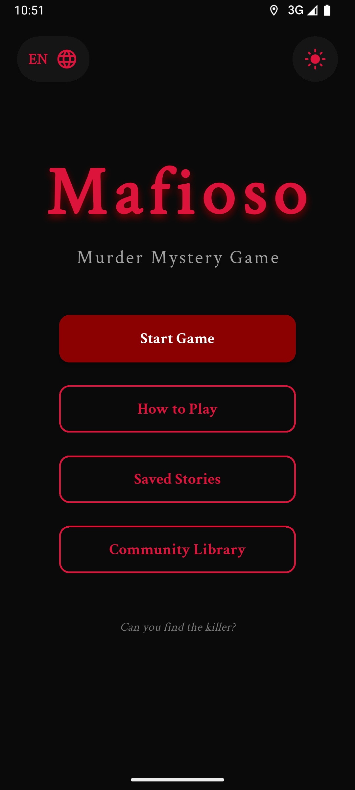&nbsp;
  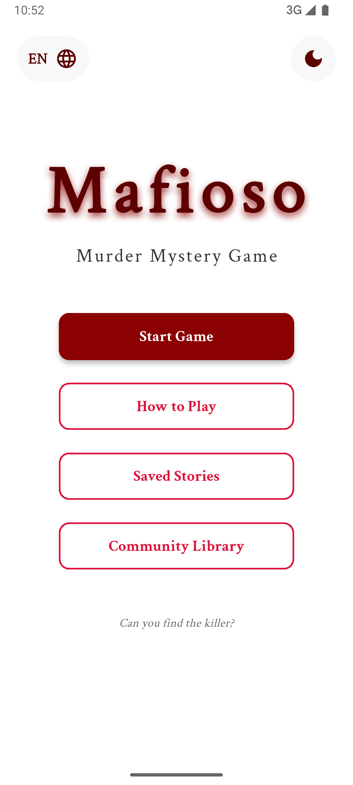&nbsp;
  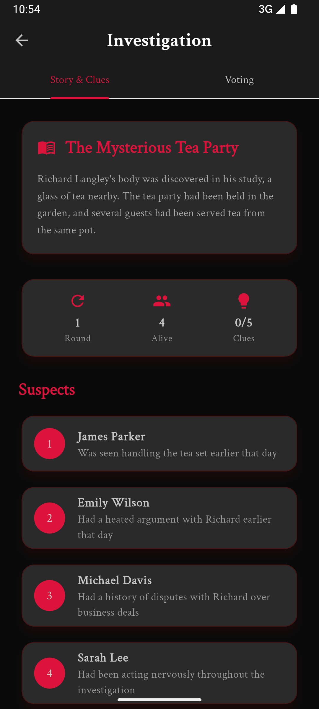&nbsp;
  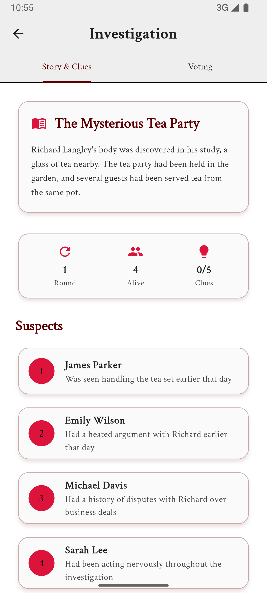
</div>

### 🌍 Dark & Light Mode (Arabic)
<div align="center">
  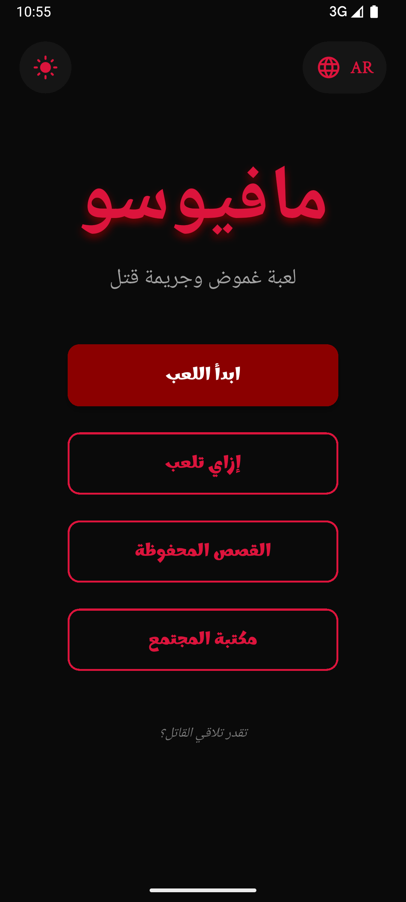&nbsp;
  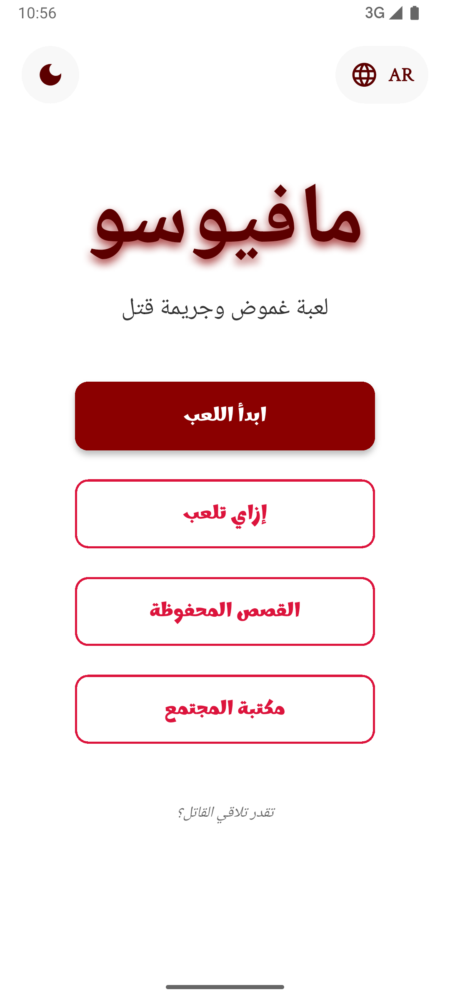&nbsp;
  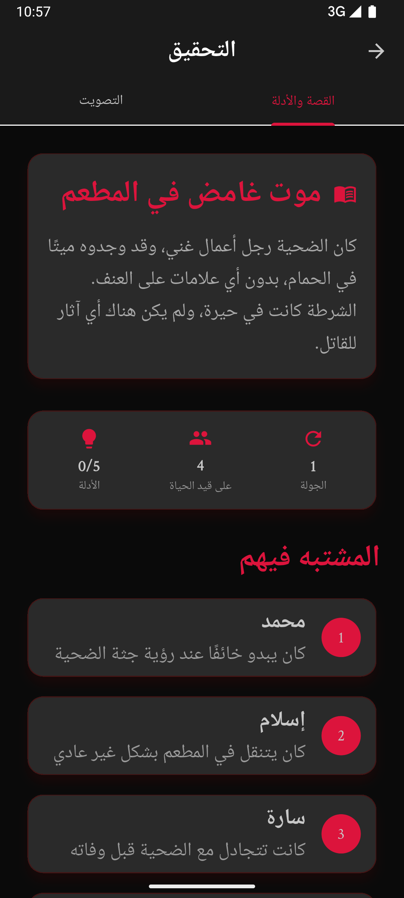&nbsp;
  
</div>

### ✨ Features Showcase
<div align="center">
  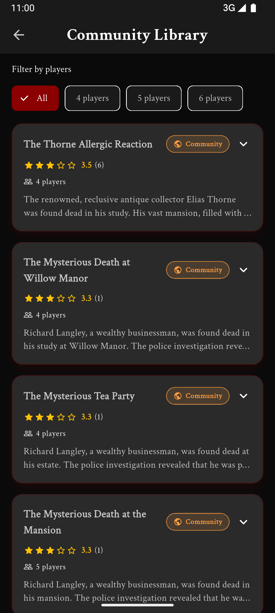&nbsp;
  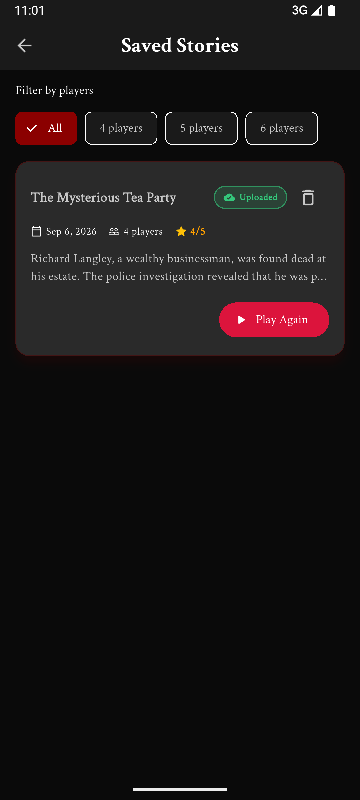&nbsp;
  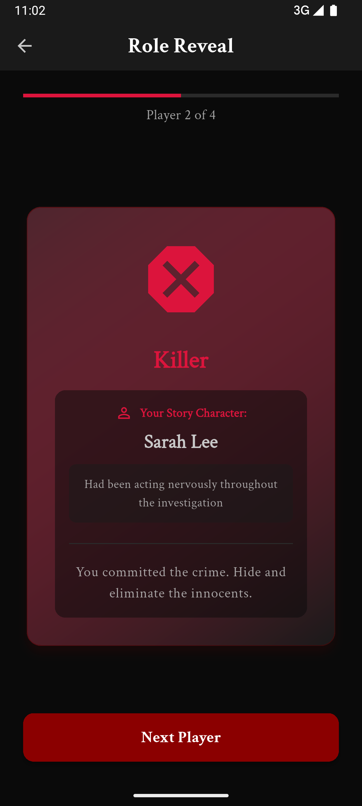&nbsp;
  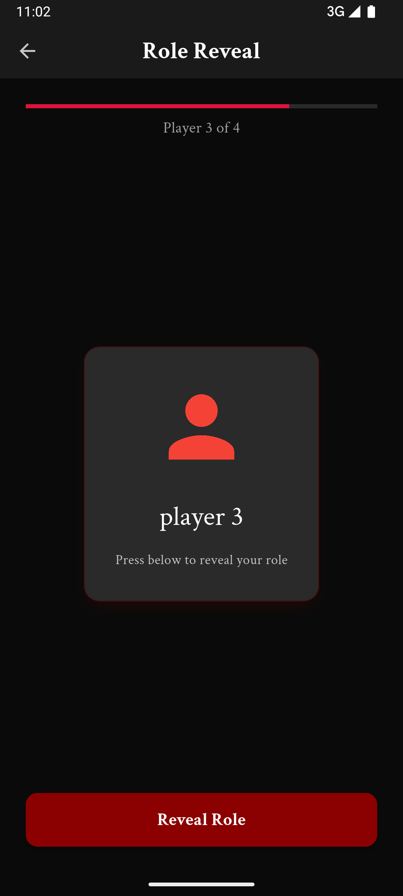
</div>
<br/>

---

## Features

- **AI stories**: Generate a new mystery from the number of suspects (4–6), with clues and a solvable twist. Provider can be **Gemini** and/or **Groq**. Includes strict JSON schema enforcement to guarantee safe, parsable generations.
- **Robust Multi-Language Generation**: Built-in handling for high token usage languages (like Arabic) and custom safety thresholds.
- **Graceful Offline Fallback**: If remote AI keys are missing or the network fails, the app seamlessly falls back to bundled JSON stories.
- **Web & Mobile Support**: Completely cross-platform, building reliably for Android, iOS, and Web.
- **Replay without regenerating**: Opening a **saved** story or a **community** story uses that story as-is (no new AI call).
- **English & Arabic**: UI and story prompts are localized (`easy_localization`, `assets/translations/`).
- **Saved stories**: Finished games are stored locally (Hive). You can delete entries, replay them, and rate them. Ratings can queue an upload to the community library when online.
- **Community library**: Browse community-submitted stories (Supabase), filter by **language** and by **player count**. 
- **Dark UI**: Premium themed layout using `flutter_screenutil` for responsive sizing across screen sizes.

---

## Tech stack

| Area | Packages / services |
|------|----------------------|
| Framework | Flutter (Dart SDK ^3.8.1) |
| State | `flutter_bloc`, `equatable` |
| DI | `get_it` |
| AI / HTTP | `dio` (separate clients for Gemini and Groq) |
| Backend | `supabase_flutter` (community library + ratings) |
| Local storage | `hive_ce`, `hive_ce_flutter` |
| Localization | `easy_localization` |
| Other | `connectivity_plus`, `crypto`, `uuid`, `shared_preferences`, `flutter_animate`, etc. |

---

## Getting started

### Prerequisites

- [Flutter](https://docs.flutter.dev/get-started/install) (see `pubspec.yaml` for SDK constraint).
- Optional: **Gemini** and **Groq** API keys for live AI generation.
- Optional: **Supabase** project URL + anon key for the community library and uploads.

### Install & run

```bash
git clone <your-repo-url>
cd mafioso
flutter pub get
flutter run
```

### API keys and Supabase (`dart-define`)

The app reads compile-time defines (see `lib/main.dart` and `lib/core/di/injection_container.dart`):

| Define | Purpose |
|--------|---------|
| `GEMINI_API_KEY` | Google Generative Language (Gemini) story generation |
| `GROQ_API_KEY` | Groq OpenAI-compatible API for story generation |
| `SUPABASE_URL` | Supabase project URL |
| `SUPABASE_ANON_KEY` | Supabase anon (public) key |

Example:

```bash
flutter run \
  --dart-define=GEMINI_API_KEY=your_key \
  --dart-define=GROQ_API_KEY=your_key \
  --dart-define=SUPABASE_URL=https://xxxx.supabase.co \
  --dart-define=SUPABASE_ANON_KEY=your_anon_key
```

You can also use a JSON file (e.g. for local dev):

```bash
flutter run --dart-define-from-file=secrets.json
```

`secrets.json` should **not** be committed; add it to `.gitignore` if you use it.

If neither `GEMINI_API_KEY` nor `GROQ_API_KEY` is provided, the app still runs but uses **offline** story assets. If you provide only one key, the app uses that provider.

---

## Game flow (high level)

1. **Start** → **Player setup**: choose suspect count (4–6), enter unique player names (no detective mode in the current build).
2. **Story**: AI or offline story matching the suspect count.
3. **Role reveal**: roles are shuffled; one killer, rest innocents; each player is matched to a story character where applicable.
4. **Investigation / game**: read clues, vote to eliminate suspects until win/loss.
5. **Summary**: outcome, optional rating; story may be saved locally and optionally uploaded to the community feed when rated and the device is online.

---

## Supabase schema notes

Community features expect roughly:

- Table **`community_stories`** with at least: `content_hash`, `language_code`, `story_json`, title/intro/crime/twist/killer metadata as used by the app, **`suspect_count`** (for player-count filters), and timestamps.
- A view such as **`community_stories_with_ratings`** used for listing (rating aggregates + `language_code` / `suspect_count` exposed for PostgREST filters).
- Table **`story_ratings`** for per-device ratings.

Apply migrations in the Supabase SQL editor to match your RLS and column names. After schema changes, regenerate any linked policies or views as needed.

---

## Building for release

Android APK example:

```bash
flutter build apk --release --dart-define-from-file=secrets.json
```

Or pass the same `--dart-define=...` values as for `flutter run`.

Output (default): `build/app/outputs/flutter-apk/app-release.apk`.

---

## Privacy

See [PRIVACY_POLICY.md](PRIVACY_POLICY.md) for data handling, third-party APIs (e.g. Google AI), and Supabase.

---

## License

Distributed under the MIT License. See `LICENSE` for details.

---

*Built with care by Eslam Abozied*
